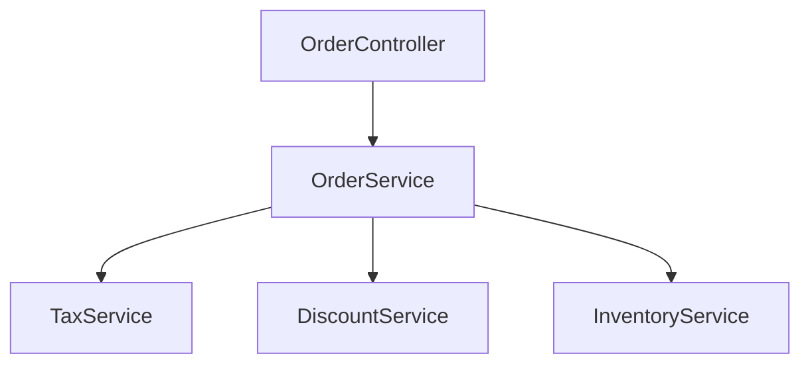

````skill
---
name: Business Logic Extraction
description: Extract and catalog business logic from source codebase for rewrite migration mode.
mode: rewrite
---

## Overview

This skill systematically identifies, extracts, and documents all business logic from a source codebase to enable accurate rewrite in a new technology stack. The goal is to ensure **functional equivalence** - the rewritten application produces the same business outcomes.

## User Input

```text
$ARGUMENTS
```

You **MUST** consider the user input before proceeding (if not empty).

## When to Use

- **Mode**: REWRITE only
- **Phase**: Step 3 (Mode-Specific Analysis) - Business Logic Inventory
- **Prerequisites**: Constitution defined, Guidelines discovered

## Extraction Process

### Step 1: Identify Business Logic Locations

Scan the source codebase for common business logic patterns:

```bash
# Example: Find potential business logic files
echo "=== Service/Business Classes ===" 
find . -name '*Service.java' -o -name '*Manager.java' -o -name '*Handler.java' | head -50

echo "=== Controller/Action Classes (entry points) ==="
find . -name '*Controller.java' -o -name '*Action.java' | head -50

echo "=== Utility/Helper Classes ==="
find . -name '*Util*.java' -o -name '*Helper*.java' | head -30

echo "=== Domain/Model Classes ==="
find . -name '*Entity.java' -o -name '*Model.java' -o -name '*DTO.java' | head -30
```

### Step 2: Categorize Business Logic

For each file, categorize the type of business logic:

| Category | Description | Examples |
|----------|-------------|----------|
| **Validation** | Input validation, business rule checks | `validateOrder()`, `isEligible()` |
| **Calculation** | Mathematical/financial computations | `calculateTax()`, `computeDiscount()` |
| **Workflow** | Multi-step business processes | `processOrder()`, `approveRequest()` |
| **Transformation** | Data conversion/mapping | `toDTO()`, `convertCurrency()` |
| **Integration** | External system interactions | `callPaymentGateway()`, `fetchExternalData()` |
| **Rules** | Business decision logic | `determineShippingMethod()`, `applyPricing()` |

### Step 3: Extract Business Logic Units

For each business logic unit, document:

```yaml
business_logic_unit:
  id: "BL-001"
  name: "Order Total Calculation"
  category: "calculation"
  source_location: "src/main/java/com/example/service/OrderService.java:45-78"
  
  description: |
    Calculates the total order amount including:
    - Item subtotals
    - Tax calculation based on region
    - Discount application
    - Shipping cost
  
  inputs:
    - name: "orderItems"
      type: "List<OrderItem>"
      description: "Items in the order with quantity and price"
    - name: "customerRegion"
      type: "String"
      description: "Customer's geographic region for tax calculation"
    - name: "discountCode"
      type: "String"
      optional: true
      description: "Optional promotional discount code"
  
  outputs:
    - name: "orderTotal"
      type: "BigDecimal"
      description: "Final order total after all calculations"
    - name: "taxAmount"
      type: "BigDecimal"
      description: "Calculated tax amount"
  
  dependencies:
    - "TaxService - for tax rate lookup"
    - "DiscountService - for discount validation"
  
  business_rules:
    - "Tax is calculated on subtotal before discount"
    - "Maximum discount is 50% of subtotal"
    - "Free shipping for orders over $100"
  
  edge_cases:
    - "Empty order returns zero total"
    - "Invalid discount code is ignored, not error"
    - "International orders have different tax rules"
  
  test_scenarios:
    - description: "Basic order with tax"
      input: "3 items, US region, no discount"
      expected_output: "subtotal + 8.5% tax"
    - description: "Order with discount"
      input: "3 items, discount code 'SAVE20'"
      expected_output: "subtotal - 20% + tax"
```

### Step 4: Generate Business Logic Inventory

Create `FEATURE_DIR/business-logic-inventory.md`:

```markdown
# Business Logic Inventory

**Source Application**: [APP_NAME]
**Extraction Date**: [DATE]
**Total Business Logic Units**: [COUNT]

## Summary by Category

| Category | Count | Complexity |
|----------|-------|------------|
| Validation | 12 | Low-Medium |
| Calculation | 8 | Medium-High |
| Workflow | 5 | High |
| Transformation | 15 | Low |
| Integration | 6 | Medium |
| Rules | 10 | Medium |

## Business Logic Units

### Validation Logic

#### BL-001: Order Validation
- **Source**: `OrderService.java:23-45`
- **Purpose**: Validates order before processing
- **Inputs**: Order object
- **Outputs**: ValidationResult
- **Rules**: [list rules]
- **Rewrite Notes**: Use Jakarta Bean Validation

[Continue for each unit...]

## Cross-Cutting Concerns

### Authentication/Authorization
- Location: [files]
- Pattern: [describe pattern]
- Rewrite approach: Use Spring Security

### Transaction Management  
- Location: [files]
- Pattern: [describe pattern]
- Rewrite approach: Use @Transactional

### Error Handling
- Location: [files]
- Pattern: [describe pattern]
- Rewrite approach: Use @ControllerAdvice

## Dependencies Map



## Rewrite Priority

| Priority | Business Logic | Reason |
|----------|---------------|--------|
| P1 | Core workflows | Essential for MVP |
| P2 | Calculations | Business critical |
| P3 | Validations | Can use framework defaults initially |
| P4 | Integrations | Can be stubbed initially |
```

## Functional Equivalence Verification

For each business logic unit, define verification criteria:

### Verification Approaches

1. **Unit Test Comparison**
   - Extract test cases from source
   - Same inputs → same outputs in target

2. **Golden Dataset Testing**
   - Capture real data samples from source system
   - Run through target implementation
   - Compare outputs

3. **Property-Based Testing**
   - Define invariants that must hold
   - Generate random inputs
   - Verify properties in both systems

### Verification Checklist

```yaml
verification:
  unit_id: "BL-001"
  status: "pending" | "verified" | "differs-intentionally"
  
  test_cases:
    - source_test: "OrderServiceTest.testCalculateTotal"
      target_test: "OrderServiceTest.testCalculateTotal"
      status: "passing"
    
  golden_data:
    - dataset: "orders_2024_sample.json"
      source_output: "orders_2024_result_source.json"
      target_output: "orders_2024_result_target.json"
      match: true
  
  intentional_differences:
    - description: "Rounding changed from HALF_UP to HALF_EVEN"
      reason: "Industry standard compliance"
      approved_by: "Product Owner"
```

## Integration with Rewrite Workflow

1. **During Planning**: Reference inventory for task breakdown
2. **During Implementation**: Use as source of truth for behavior
3. **During Testing**: Verify functional equivalence per unit
4. **During Validation**: Ensure all units are implemented

## Output Artifacts

| Artifact | Path | Purpose |
|----------|------|---------|
| Business Logic Inventory | `FEATURE_DIR/business-logic-inventory.md` | Master list of all business logic |
| Extraction Report | `FEATURE_DIR/extraction-report.md` | Summary of extraction process |
| Verification Checklist | `FEATURE_DIR/verification-checklist.yaml` | Track equivalence verification |

## Key Rules

- **Completeness**: Every piece of business logic must be documented
- **No Implementation Details**: Focus on WHAT, not HOW (that's for target design)
- **Testability**: Each unit must have clear inputs, outputs, and test scenarios
- **Traceability**: Link to source code locations for reference during implementation
````
